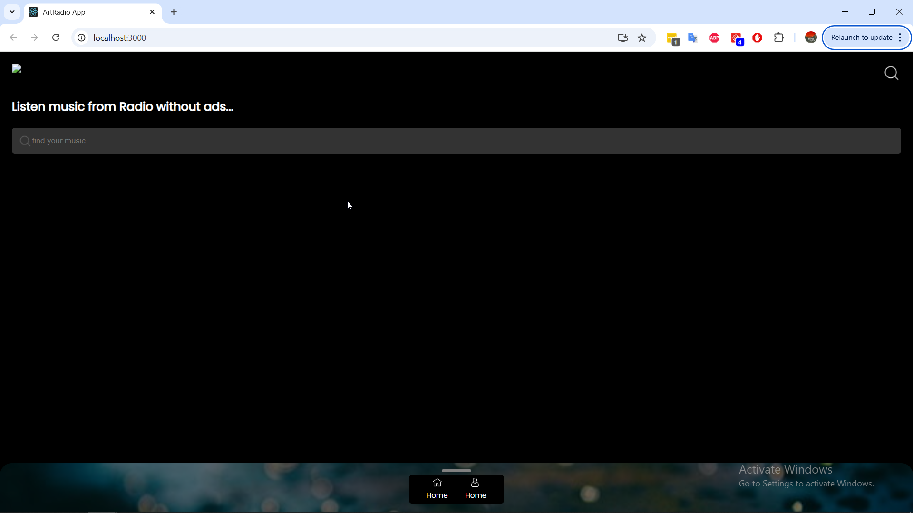

# reactArtRadio 1.0 - An React web app


This is the first version of **ArtRadio** frontend application (for latest version you can check [ngArtRadio v2.0](https://github.com/devraider/ngArtRadio-v2.0)).

It's an ad-free online radio player built with ReactJS. 
  
> [!note]
> This project using Python, Django framework as backend – code could be found   [djangoArtRadio - v1.0](https://github.com/devraider/djangoArtRadio-v1.0)

## I.1. Presentation images

1. Home page



## I.2. Features

- **Stream Radio Stations**: Access multiple stations for uninterrupted listening.
- **Track History**: See a list of recently played songs from each station's playlist.
- **Song Replays**: Replay songs through YouTube using the embedded player, without any ads.
- **Playback Controls**: Includes next, previous, play, pause, and volume control options.
- **MP3 Playback**: Plays MP3 files directly from the backend.
- **Responsive Design**: Works smoothly on both desktop and mobile.

## I.3. Technologies Used

- **React**: Core library for building the app’s interactive user interface.
- **Axios**: Handles HTTP requests for data fetching from APIs.

## I.4. Getting Started

### I.4.1. Prerequisites

- **Node.js** (v14+)
- **npm** (10.8+)
- **ReactJS** (18+)

> [!warning]
> You need to have [djangoArtRadio - v1.0](https://github.com/devraider/djangoArtRadio-v1.0) up and running before starting web application.


### I.4.2. Installation and Setup

1. **Clone the repository:**

```bash

   git clone https://github.com/devraider/reactArtRadio-v1.0.git

   cd reactArtRadio-v1.0

```
2. **Install dependencies**

```bash
    npm install
```

### I.4.3. Run the application
```bash
   npm start
```